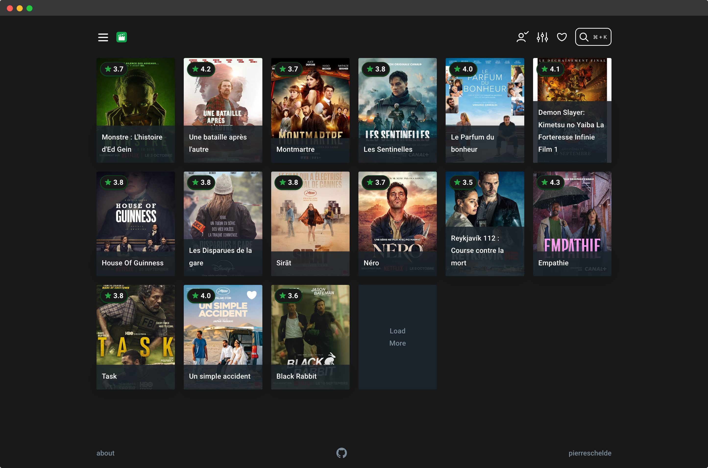
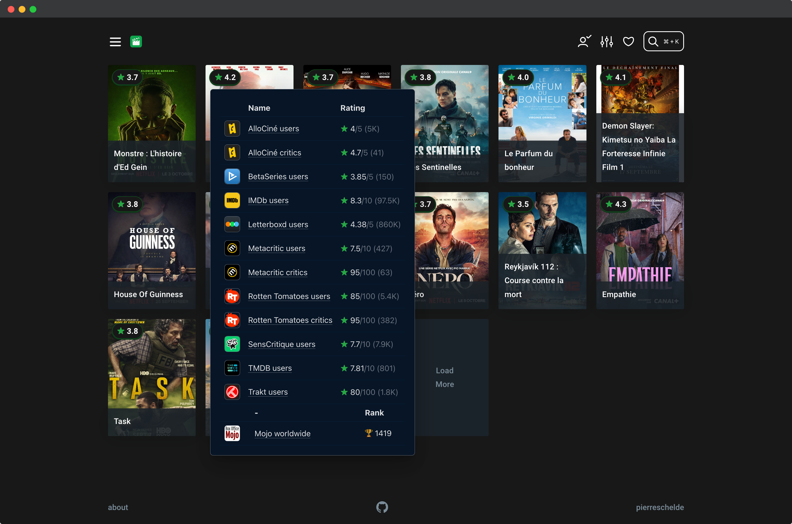
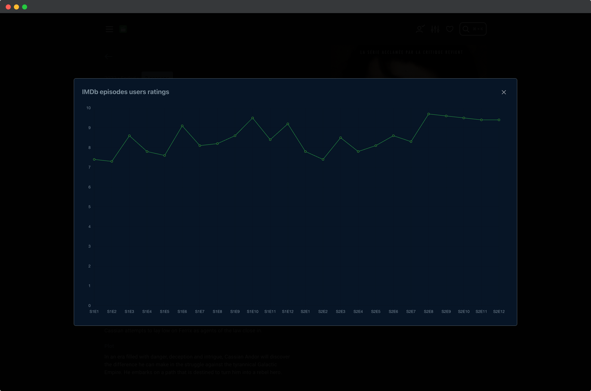
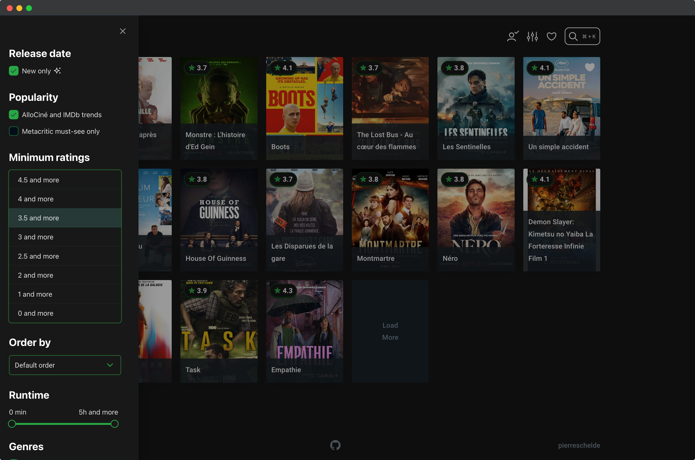
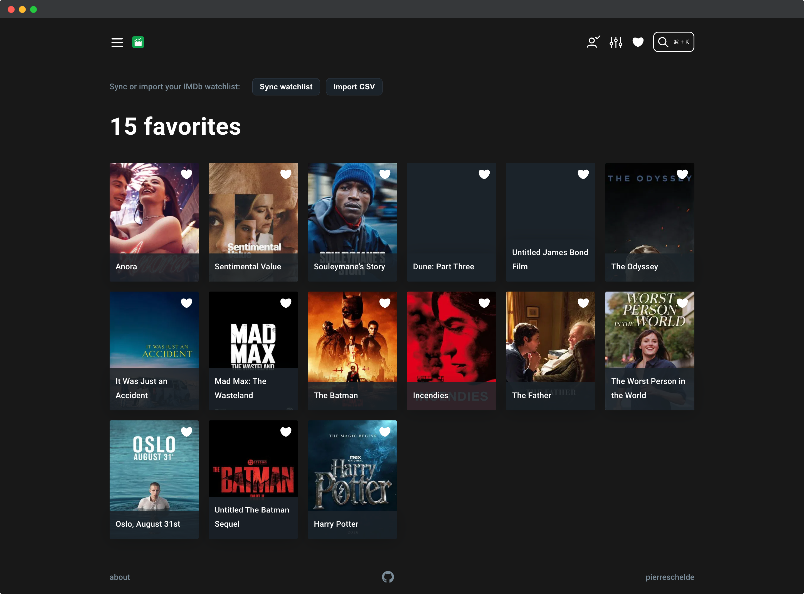
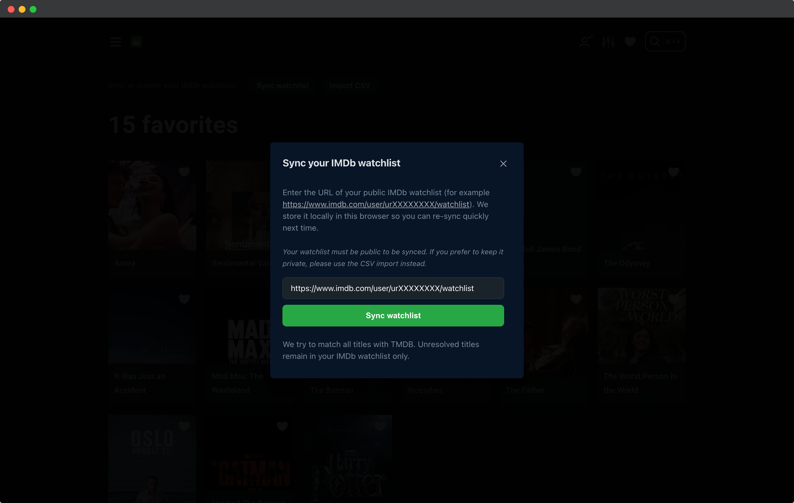
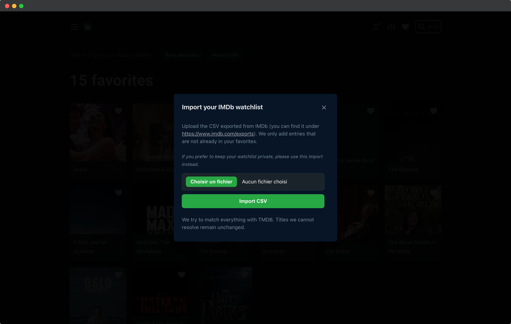

  

<h1 align="center">
  <a href="https://whatson-app.com">What's on?</a>
</h1>

<a href="https://whatson-app.com">whatson-app.com</a>

Companion to [What's on? API](https://github.com/pierrevano/whatson-api)

---

## Homepage

## Ratings

## Item details

## Episodes details

## Filters

## Favorites

## IMDb watchlist sync

## IMDb watchlist import

## Mobile

